# RAGMaker Standalone Desktop - Architecture Diagrams

## System Overview Architecture

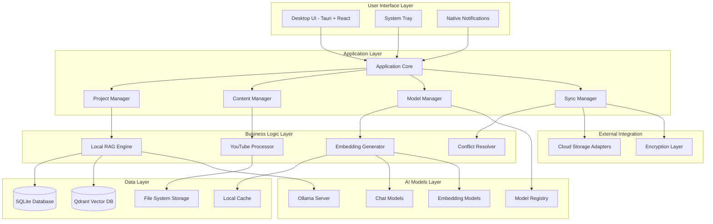

## Component Interaction Flow

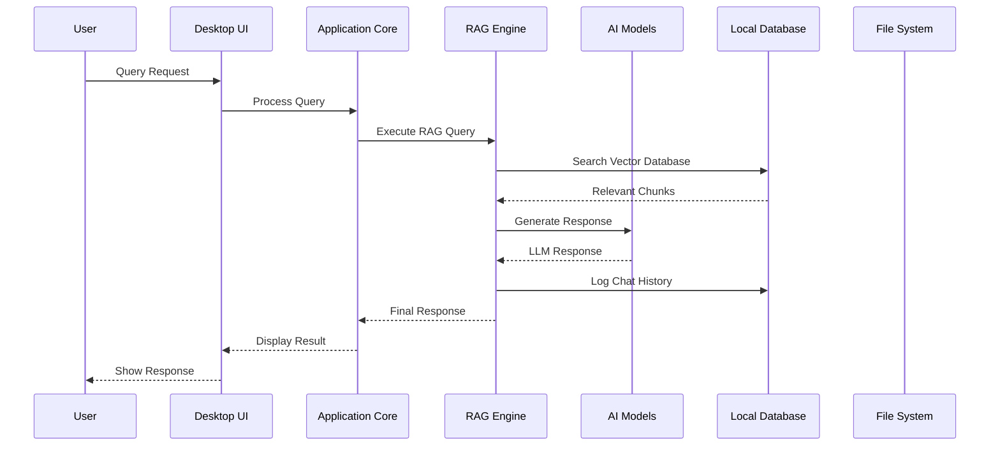

## YouTube Content Processing Pipeline

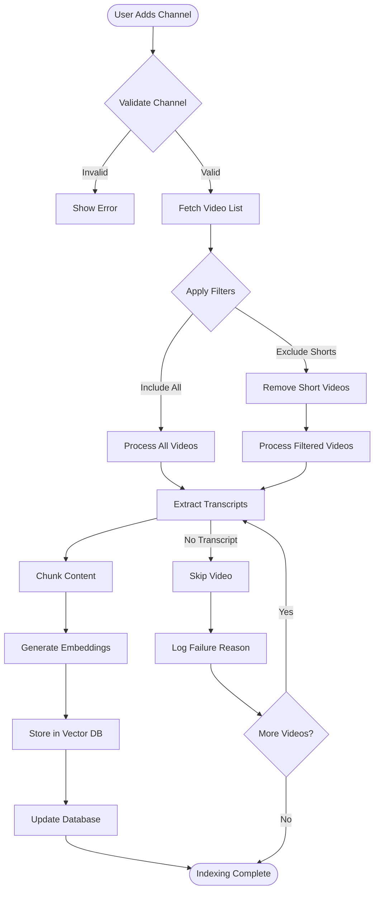

## Local RAG Query Processing

```mermaid
flowchart LR
    subgraph "Query Processing"
        Query[User Query] --> Embed[Generate Query Embedding]
        Embed --> Search[Vector Similarity Search]
    end
    
    subgraph "Context Building"
        Search --> Retrieve[Retrieve Top-K Chunks]
        Retrieve --> Filter[Apply Relevance Filters]
        Filter --> Rank[Re-rank Results]
        Rank --> Context[Build Context Window]
    end
    
    subgraph "Response Generation"
        Context --> Template[Apply Prompt Template]
        Template --> LLM[Local LLM Generation]
        LLM --> PostProcess[Post-process Response]
        PostProcess --> Response[Final Response]
    end
    
    subgraph "Storage & Learning"
        Response --> Store[Store Chat History]
        Store --> UpdateStats[Update Performance Metrics]
        UpdateStats --> Cache[Update Cache]
    end
```

## Data Storage Architecture

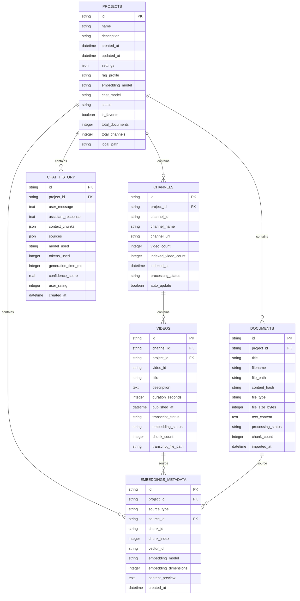

## File System Organization

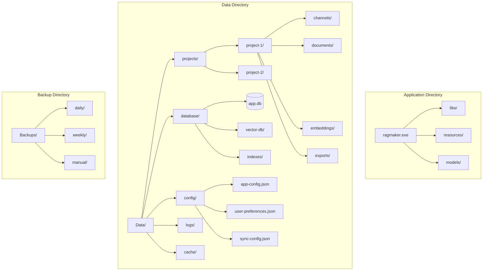

## Model Management Flow

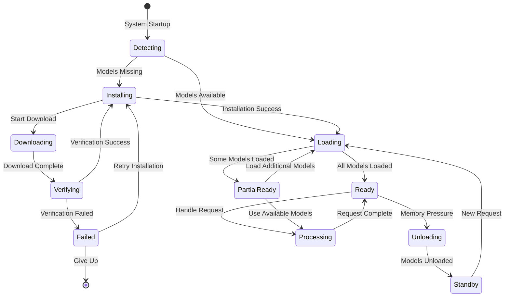

## Cloud Sync Process Flow

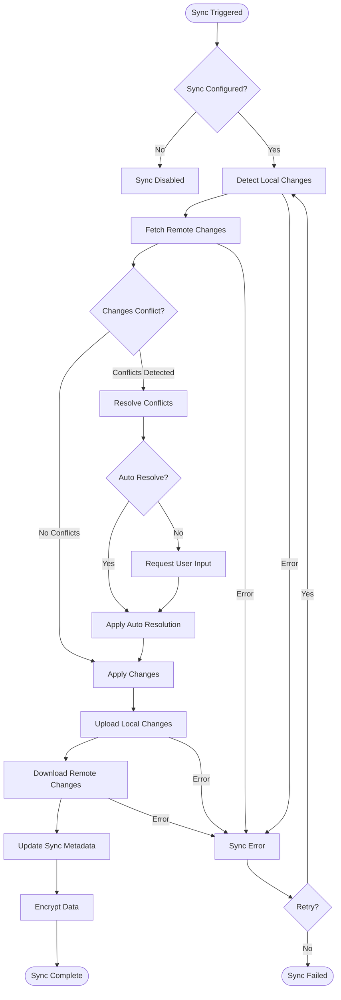

## Performance Monitoring Dashboard

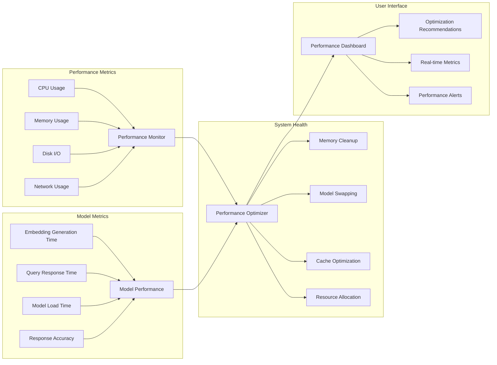

## Security Architecture

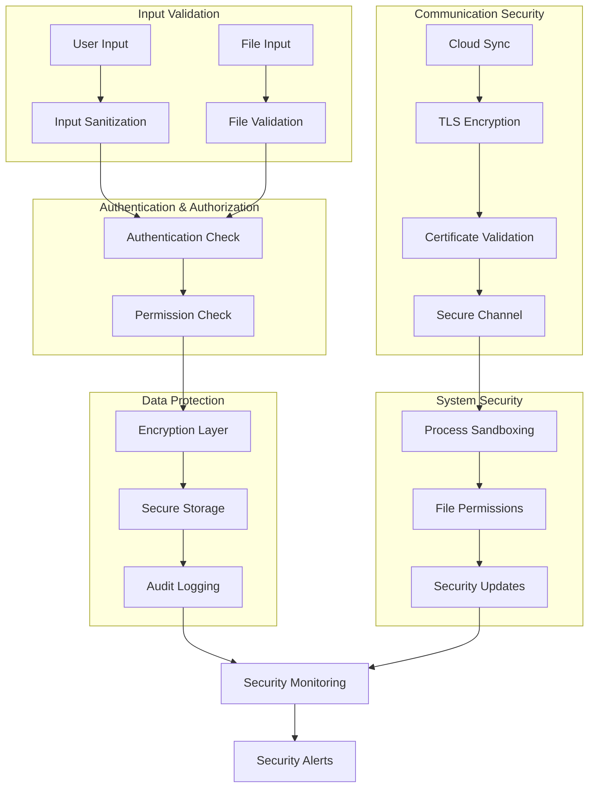

## Deployment Architecture

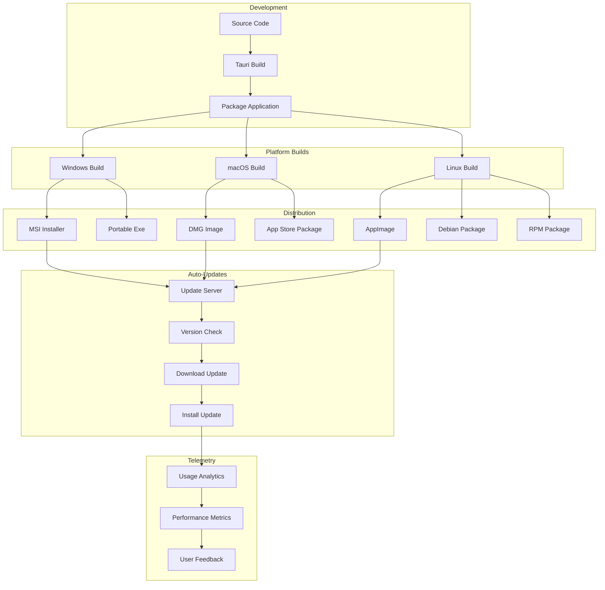

These comprehensive architecture diagrams provide visual representations of all major components and interactions in the standalone RAGMaker desktop application, from high-level system overview to detailed implementation flows.